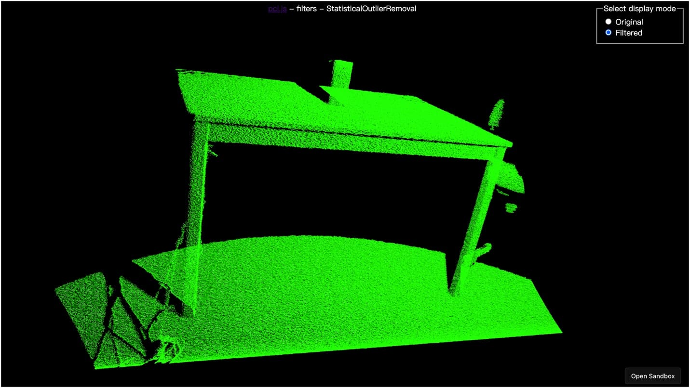
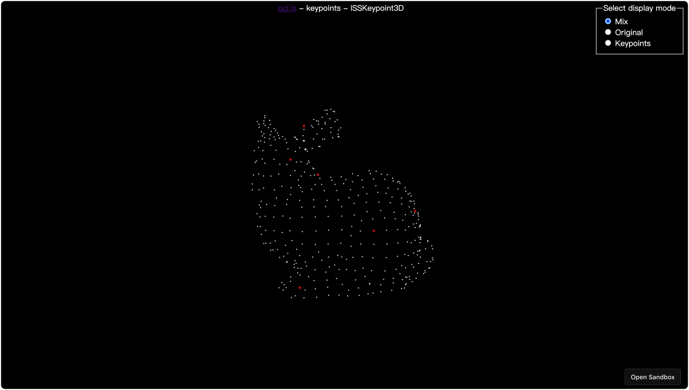

<p align="center">
  <a href="https://pcljs.org/zh-cn" target="_blank"></a>
  <p align="center">在浏览器运行的<a href="https://pointclouds.org" target="_blank">点云库 (PCL)</a>，由 WebAssembly 提供支持。</p>
</p>

<p align="center">
  <a href="https://github.com/luoxuhai/pcl.js/actions/workflows/test.yml">
    
  </a>
  <a href="https://www.npmjs.com/package/pcl.js">
    
  </a>
 <a href="https://bundlephobia.com/package/pcl.js">
    
 </a>
 <a href="https://github.com/FoalTS/foal/blob/master/LICENSE">
    
  </a>
  <a href="https://www.npmtrends.com/pcl.js">
    
  </a>
  <a href="https://www.jsdelivr.com/package/npm/pcl.js">
    
  </a>
  <a href="https://openbase.com/js/pcl.js?utm_source=embedded&amp;utm_medium=badge&amp;utm_campaign=rate-badge">
    
  </a>
  <a href="https://deepscan.io/dashboard#view=project&tid=18815&pid=22098&bid=649724">
    
  </a>
</p>

<p align="center">
  <a href="./README.md">English</a> | 简体中文
</p>

## 简介

**pcl.js** 是在浏览器中运行的 [Point Cloud Library (PCL)](https://pointclouds.org)，由 [Emscripten](https://emscripten.org/index.html) 和 [WebAssembly](https://webassembly.org/) 提供支持。[Point Cloud Library (PCL)](https://pointclouds.org) 是一个独立、大型、开源的 2D/3D 图像和点云处理库。

## 示例

<p>
  <a href="https://kl2zjs.csb.app"></a>
  <a href="https://3l6tfj.csb.app"></a>

  <h4><a href="https://pcljs.org/zh-cn/examples">查看所有示例</a></h4>
<p>

## 特性

- 提供与 PCL(C++) 相似的 API，简单易用
- 支持所有现代浏览器，未来将提供对 Nodejs 的支持
- 用 TypeScript 编写，具有可预测的静态类型
- 还有很多很多！🚀

## 资源

- [文档](https://pcljs.org/zh-cn/docs/tutorials/intro)
- [API](https://pcljs.org/zh-cn/docs/api/about)
- [示例](https://pcljs.org/zh-cn/examples)
- [讨论](https://github.com/luoxuhai/pcl.js/discussions)

## 支持的环境

| <br/> Edge | <br/>Firefox | <br/>Chrome | <br/>Safari | <br/>Opera |
| --------- | --------- | --------- | --------- | --------- |
| 16+ | 52+ | 57+ | 11+ | 44+ 

## 资源大小

> pcl.js version: latest

| 资源          |                                                    链接                                                     |     大小      |
| :------------ | :---------------------------------------------------------------------------------------------------------: | :-----------: |
| pcl.js        |     [https://cdn.jsdelivr.net/npm/pcl.js/dist/pcl.js](https://cdn.jsdelivr.net/npm/pcl.js/dist/pcl.js)      | ~34k gzip’d |
| pcl-core.wasm | [https://cdn.jsdelivr.net/npm/pcl.js/dist/pcl-core.wasm](https://cdn.jsdelivr.net/npm/pcl.js/dist/pcl-core.wasm) | ~360k gzip’d  |

## 安装

### NPM

```bash
# NPM
npm install pcl.js

# Yarn
yarn add pcl.js
```

### CDN

```html
<!-- 开发环境 -->
<script src="https://cdn.jsdelivr.net/npm/pcl.js/dist/pcl.js"><script>

<!-- 生产环境 -->
<script src="https://cdn.jsdelivr.net/npm/pcl.js/dist/pcl.min.js"><script>
```

## 使用

### NPM

```typescript
import * as PCL from 'pcl.js';

async function main() {
  // 初始化
  const pcl = await PCL.init({
    /**
     * 推荐，可选配置，自定义 WebAssembly 文件链接
     * @default js 文件所在目录 + pcl-core.wasm
     */
    url: 'https://cdn.jsdelivr.net/npm/pcl.js/dist/pcl-core.wasm',
  });

  // ...
}

main();
```

### CDN

```html
<script>
async function main() {
  // 初始化，PCL 是全局对象
  const pcl = await PCL.init();
  // ...
}

main();
</script>
```
### 简单示例
```typescript
// TypeScript

import * as PCL from 'pcl.js';

async function main() {
  const pcl = await PCL.init({
    url: 'https://cdn.jsdelivr.net/npm/pcl.js/dist/pcl-core.wasm',
  });

  // 获取 PCD 文件
  const data = await fetch('https://cdn.jsdelivr.net/gh/luoxuhai/pcl.js@master/data/rops_tutorial/points.pcd').then(res => res.arrayBuffer());
  // 加载 PCD 数据，返回点云对象
  const cloud = pcl.io.loadPCDData<PCL.PointXYZ>(data, PCL.PointXYZ);

  // 使用 PassThrough 过滤器过滤点云
  // 参考: https://pcl.readthedocs.io/projects/tutorials/en/master/passthrough.html#passthrough
  const pass = new pcl.filters.PassThrough<PCL.PointXYZ>(PCL.PointXYZ);
  pass.setInputCloud(cloud);
  pass.setFilterFieldName('z');
  pass.setFilterLimits(0.0, 1.0);
  const cloudFiltered = pass.filter();

  // 将过滤后的点云对象保存为 PCD 文件, 内容为 ArrayBuffer
  const cloudFilteredData = pcl.io.savePCDDataASCII(cloudFiltered);
}

main();
```

## 变更日志

[更改日志](https://github.com/luoxuhai/pcl.js/releases) 会定期更新，以反映每个新版本中的更改内容。

## 路线图

查看完整的 [路线图](ROADMAP-zh_CN.md)。

## 在线开发

你可以使用 Gitpod 进行在线开发：

[](https://gitpod.io/#https://github.com/luoxuhai/pcl.js)

## 贡献

pcl.js 已采用 [贡献者公约](https://www.contributor-covenant.org/) 作为其行为准则，我们希望项目参与者遵守它，请阅读 [全文](CODE_OF_CONDUCT-zh_CN.md) 以确保你能明白哪些是可以做的，哪些是不可以做的。

请阅读我们的 [贡献指南](CONTRIBUTING-zh_CN.md) 以了解我们的开发过程。

感谢所有为 pcl.js 做出贡献的人！

[](https://github.com/luoxuhai/pcl.js/graphs/contributors)

## 协议

这个项目是根据 [MIT](https://github.com/luoxuhai/pcl.js/blob/master/LICENSE) 条款获得许可的。

<a href="https://www.producthunt.com/posts/pcl-js?utm_source=badge-featured&utm_medium=badge&utm_souce=badge-pcl&#0045;js" target="_blank"></a>
