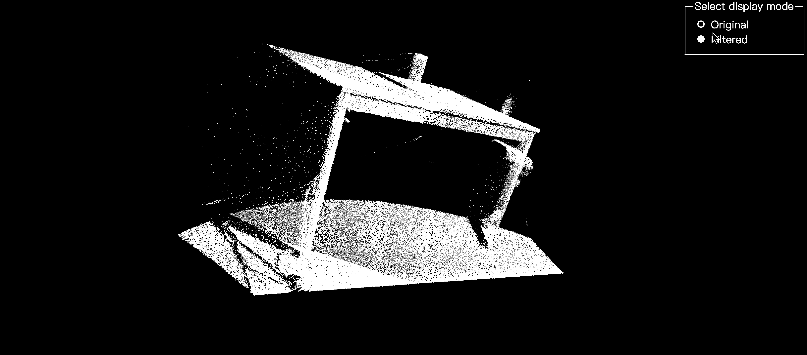

<p align="center">
  <a href="https://pcljs.org/zh-cn" target="_blank"></a>
  <p align="center">在浏览器运行的<a href="https://github.com/PointCloudLibrary/pcl" target="_blank">点云库 (PCL)</a>，由 WebAssembly 提供支持。</p>
</p>
<p align="center">
 <a href="https://github.com/FoalTS/foal/blob/master/LICENSE">
    
  </a>
 <a href="https://packagephobia.com/result?p=pcl.js">
    
  </a>
    <a href="https://badge.fury.io/js/pcl.js">
    
  </a>
  <a href="https://www.npmtrends.com/pcl.js">
    
  </a>
  <a href="https://github.com/luoxuhai/pcl.js/stargazers">
    
  </a>
  <a href="https://www.jsdelivr.com/package/npm/pcl.js">
    
  </a>
  <a href="https://openbase.com/js/pcl.js?utm_source=embedded&amp;utm_medium=badge&amp;utm_campaign=rate-badge">
    
  </a>
  <a href="https://deepscan.io/dashboard#view=project&tid=18815&pid=22098&bid=649724">
    
  </a>
</p>

<p align="center">
  <a href="./README.md">English</a> | 简体中文
</p>

## 简介

**pcl.js** 是在浏览器中运行的 [Point Cloud Library (PCL)](https://github.com/PointCloudLibrary/pcl)，由 [Emscripten](https://emscripten.org/index.html) 和 [WebAssembly](https://webassembly.org/) 提供支持。[Point Cloud Library (PCL)](https://github.com/PointCloudLibrary/pcl) 是一个独立、大型、开源的 2D/3D 图像和点云处理库。

**使用 [StatisticalOutlierRemoval](https://pcl.readthedocs.io/projects/tutorials/en/master/statistical_outlier.html#statistical-outlier-removal) 过滤器去除点云数据中的异常值演示**
<p align="center">
  <a href="https://pcljs.org/zh-cn/examples/detail?code_url=https%3A%2F%2Fstackblitz.com%2Fedit%2Fweb-platform-ugzuzp%3Fembed%3D1%26file%3Dmain.js%26hideNavigation%3D1%26view%3Dpreview">
    
  </a>
</p>

## 特性

- 提供与 PCL(C++) 相似的 API，简单易用
- 支持所有现代浏览器，未来将提供对 Nodejs 的支持
- 用 TypeScript 编写，具有可预测的静态类型
- 还有很多很多！🚀

## 资源

- [文档](https://pcljs.org/zh-cn/docs/tutorials/intro)
- [API](https://pcljs.org/zh-cn/docs/api/intro)
- [示例](https://pcljs.org/zh-cn/examples)
- [讨论](https://github.com/luoxuhai/pcl.js/discussions)

## 支持的环境

| <br/> Edge | <br/>Firefox | <br/>Chrome | <br/>Safari | <br/>Opera |
| --------- | --------- | --------- | --------- | --------- |
| 16+ | 52+ | 57+ | 11+ | 44+ 

## 资源大小

> pcl.js version: latest

| 资源          |                                                    链接                                                     |     大小      |
| :------------ | :---------------------------------------------------------------------------------------------------------: | :-----------: |
| pcl.js        |     [https://cdn.jsdelivr.net/npm/pcl.js/dist/pcl.js](https://cdn.jsdelivr.net/npm/pcl.js/dist/pcl.js)      | ~33k gzip’d |
| pcl-core.wasm | [https://cdn.jsdelivr.net/npm/pcl.js/dist/pcl-core.wasm](https://cdn.jsdelivr.net/npm/pcl.js/dist/pcl.wasm) | ~199k gzip’d  |

## 安装

### NPM

```bash
# NPM
npm install pcl.js

# Yarn
yarn add pcl.js
```

### CDN

```html
<!-- 开发环境 -->
<script src="https://cdn.jsdelivr.net/npm/pcl.js/dist/pcl.js"><script>

<!-- 生产环境 -->
<script src="https://cdn.jsdelivr.net/npm/pcl.js/dist/pcl.min.js"><script>
```

## 使用

### NPM

```typescript
import * as PCL from 'pcl.js';

async function main() {
  // 初始化
  const pcl = await PCL.init({
    /**
     * 推荐，可选配置，自定义 WebAssembly 文件链接
     * @default js 文件所在目录 + pcl-core.wasm
     */
    url: 'https://cdn.jsdelivr.net/npm/pcl.js/dist/pcl-core.wasm',
  });

  // ...
}

main();
```

### CDN

```html
<script>
async function main() {
  // 初始化，PCL 是全局对象
  const pcl = await PCL.init();
  // ...
}

main();
</script>
```
### 简单示例
```typescript
import * as PCL from 'pcl.js';

async function main() {
  const pcl = await PCL.init({
    url: 'https://cdn.jsdelivr.net/npm/pcl.js/dist/pcl-core.wasm',
  });

  // 获取 PCD 文件
  const pcd = await fetch('https://cdn.jsdelivr.net/gh/luoxuhai/pcl.js@master/data/rops_tutorial/points.pcd').then(res => res.arrayBuffer());
  // 写入 PCD 文件
  pcl.fs.writeFile('/test.pcd', new Uint8Array(pcd));
  // 加载 PCD 文件，返回点云对象
  const cloud = pcl.io.loadPCDFile<PCL.PointXYZ>('/test.pcd', PCL.PointXYZ);

  // 使用 PassThrough 过滤器过滤点云
  // 参考: https://pcl.readthedocs.io/projects/tutorials/en/master/passthrough.html#passthrough
  const pass = new pcl.filters.PassThrough<PCL.PointXYZ>(PCL.PointXYZ);
  pass.setInputCloud(cloud);
  pass.setFilterFieldName('z');
  pass.setFilterLimits(0.0, 1.0);
  const cloudFiltered = pass.filter();
  // 也可以和 C++ 中写法保存一致
  // const cloudFiltered = pcl.common.PointCloud<PCL.PointXYZ>(PCL.PointXYZ);
  // pass.filter(cloudFiltered);

  // 将过滤后的点云对象保存为 PCD 文件
  pcl.io.savePCDFileASCII('/test-filtered.pcd', cloudFiltered);
  // 读取 PCD 文件内容， 内容为 ArrayBuffer
  const pcd = pcl.fs.readFile('/test-filtered.pcd');

  // 删除所有 PCD 文件
  pcl.fs.unlink('/test.pcd')
  pcl.fs.unlink('/test-filtered.pcd')
  // ...
}

main();
```

## 路线图

查看完整的[路线图](ROADMAP-zh_CN.md)。

## 贡献

请阅读我们的 [贡献指南](CONTRIBUTING-zh_CN.md) 以了解我们的开发过程。

感谢所有为 pcl.js 做出贡献的人！

[](https://github.com/luoxuhai/pcl.js/graphs/contributors)


## 协议

[MIT](https://github.com/luoxuhai/pcl.js/blob/master/LICENSE)
