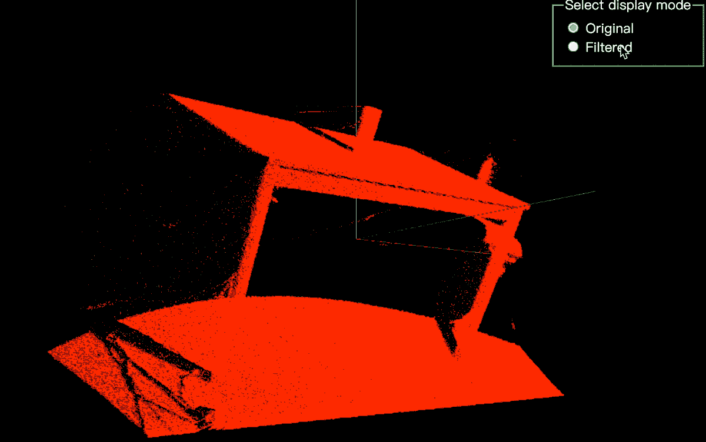

<p align="center">
  <a href="https://pcljs.org" target="_blank"></a>
  <p align="center"><a href="https://github.com/PointCloudLibrary/pcl" target="_blank">Point Cloud Library (PCL)</a> for browser, powered by WebAssembly.</p>
</p>

<p align="center">
 <a href="https://github.com/FoalTS/foal/blob/master/LICENSE">
    
  </a>
 <a href="https://packagephobia.com/result?p=pcl.js">
    
  </a>
    <a href="https://badge.fury.io/js/pcl.js">
    
  </a>
  <a href="https://www.npmtrends.com/pcl.js">
    
  </a>
  <a href="https://github.com/luoxuhai/pcl.js/stargazers">
    
  </a>
  <a href="https://www.jsdelivr.com/package/npm/pcl.js">
    
  </a>
  <a href="https://openbase.com/js/pcl.js?utm_source=embedded&amp;utm_medium=badge&amp;utm_campaign=rate-badge">
    
  </a>
  <a href="#badge">
    
  </a>
</p>

<p align="center">
  English | <a href="./README-zh_CN.md">简体中文</a>
</p>

## Overview

**pcl.js** is a [Point Cloud Library (PCL)](https://github.com/PointCloudLibrary/pcl) that runs in the browser, powered by [Emscripten](https://emscripten.org/index.html) and [WebAssembly](https://webassembly.org/). [Point Cloud Library (PCL)](https://github.com/PointCloudLibrary/pcl) is a standalone, large scale, open project for 2D/3D image and point cloud processing. 

**Removing outliers using a StatisticalOutlierRemoval filter demo**
<p align="center">
  <a href="https://pcljs.org/examples/detail?code_url=https%3A%2F%2Fstackblitz.com%2Fedit%2Fweb-platform-ugzuzp%3Fembed%3D1%26file%3Dmain.js%26hideNavigation%3D1%26view%3Dpreview">
    
  </a>
</p>

## Resources

- [Documentation](https://pcljs.org/docs/tutorials/intro)
- [API Reference](https://pcljs.org/docs/api/intro)
- [Examples](https://pcljs.org/examples)
- [Discussions](https://github.com/luoxuhai/pcl.js/discussions)

## Environment Support
> https://developer.mozilla.org/en-US/docs/WebAssembly#browser_compatibility

| <br/> Edge | <br/>Firefox | <br/>Chrome | <br/>Safari | <br/>Opera | <br/>Node.js |  <br/> Deno |
| --------- | --------- | --------- | --------- | --------- | --------- | --------- |
| 16+ | 52+ | 57+ | 11+ | 44+ | 11.0.0+| 1.0+

## Installation

### NPM

```bash
# NPM
npm install pcl.js

# Yarn
yarn add pcl.js
```

### CDN

#### Development

```html
<script src="https://cdn.jsdelivr.net/npm/pcl.js/dist/pcl.js"><script>
```

#### Production

```html
<script src="https://cdn.jsdelivr.net/npm/pcl.js/dist/pcl.min.js"><script>
```

## Usage

### NPM

```typescript
import PCL from 'pcl.js';

async function main() {
  // Initialization
  const pcl = await PCL.init({
    // Recommend, optional configuration, custom WebAssembly file link.
    url: 'https://cdn.jsdelivr.net/npm/pcl.js/dist/pcl-core.wasm',
    // You can also pass an ArrayBuffer of WebAssembly files.
    // arrayBuffer: ArrayBuffer
  });

  // ...
}

main();
```

### CDN

```html
<script>
async function main() {
  // Initialization, PCL is a global object.
  const pcl = await PCL.init({
    // Recommend, optional configuration, custom WebAssembly file link.
    url: 'https://cdn.jsdelivr.net/npm/pcl.js/dist/pcl-core.wasm',
    // You can also pass an ArrayBuffer of WebAssembly files.
    // arrayBuffer: ArrayBuffer
  });

  // ...
}

main();
</script>
```

### Simple Example
```typescript
import PCL from 'pcl.js';

async function main() {
  const pcl = await PCL.init({
    url: 'https://cdn.jsdelivr.net/npm/pcl.js/dist/pcl-core.wasm',
  });

  // Get PCD file
  const pcd = await fetch('https://cdn.jsdelivr.net/gh/luoxuhai/pcl.js@master/data/rops_tutorial/points.pcd').then(res => res.arrayBuffer());
  // Write a PCD file
  pcl.fs.writeFile('/test.pcd', new Uint8Array(pcd));
  // Load PCD file, return point cloud object
  const pointCloud = pcl.io.loadPCDFile('/test.pcd');

  // Filtering a PointCloud using a PassThrough filter
  // See: https://pcl.readthedocs.io/projects/tutorials/en/master/passthrough.html#passthrough
  const pass = new pcl.filters.PassThrough();
  pass.setInputCloud(pointCloud);
  pass.setFilterFieldName('z');
  pass.setFilterLimits(0.0, 1.0);
  pass.filter(pointCloud);

  // Save filtered point cloud objects as PCD files
  pcl.io.savePCDFileASCII('/test-filtered.pcd', pointCloud);
  // Read PCD file content, the content is ArrayBuffer
  const pcd = pcl.fs.readFile('/test-filtered.pcd');

  // Delete all PCD files
  pcl.fs.unlink('/test.pcd')
  pcl.fs.unlink('/test-filtered.pcd')
  // ...
}

main();
```


## Bundle Size

> PCL.js Version: latest

| Source        |                                                    Link                                                     |     Size      |
| :------------ | :---------------------------------------------------------------------------------------------------------: | :-----------: |
| pcl.js        |     [https://cdn.jsdelivr.net/npm/pcl.js/dist/pcl.js](https://cdn.jsdelivr.net/npm/pcl.js/dist/pcl.js)      | ~32.3k gzip’d |
| pcl-core.wasm | [https://cdn.jsdelivr.net/npm/pcl.js/dist/pcl-core.wasm](https://cdn.jsdelivr.net/npm/pcl.js/dist/pcl.wasm) | ~198k gzip’d  |

## Modules

- [ ] features
- [x] filters 50%
- [ ] geometry
- [x] io 50%
- [ ] kdtree
- [ ] keypoints
- [ ] octree
- [ ] outofcore
- [ ] recognition
- [x] registration 10%
- [ ] sample_consensus
- [ ] search
- [ ] segmentation
- [ ] surface

## License

[MIT](https://github.com/luoxuhai/pcl.js/blob/master/LICENSE)
