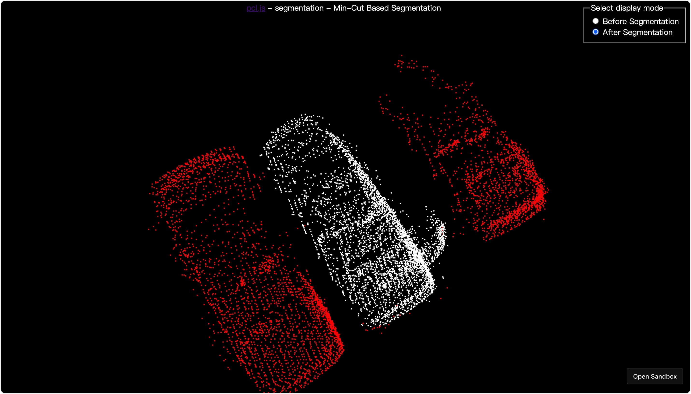

<p align="center">
  <a href="https://pcljs.org" target="_blank"></a>
  <p align="center"><a href="https://pointclouds.org" target="_blank">Point Cloud Library (PCL)</a> for browser, powered by WebAssembly.</p>
</p>

<p align="center">
  <a href="https://github.com/luoxuhai/pcl.js/actions/workflows/test.yml">
    
  </a>
  <a href="https://www.npmjs.com/package/pcl.js">
    
  </a>
 <a href="https://bundlephobia.com/package/pcl.js">
    
 </a>
 <a href="https://github.com/FoalTS/foal/blob/master/LICENSE">
    
  </a>
  <a href="https://www.npmtrends.com/pcl.js">
    
  </a>
  <a href="https://www.jsdelivr.com/package/npm/pcl.js">
    
  </a>
  <a href="https://openbase.com/js/pcl.js?utm_source=embedded&amp;utm_medium=badge&amp;utm_campaign=rate-badge">
    
  </a>
  <a href="https://deepscan.io/dashboard#view=project&tid=18815&pid=22098&bid=649724">
    
  </a>
</p>

<p align="center">
  English | <a href="./README-zh_CN.md">简体中文</a>
</p>

## Overview

**pcl.js** is a [Point Cloud Library (PCL)](https://pointclouds.org) that runs in the browser, powered by [Emscripten](https://emscripten.org) and [WebAssembly](https://webassembly.org)

The [Point Cloud Library (PCL)](https://pointclouds.org) is a large scale, open project for 2D/3D image and point cloud processing. The PCL framework contains numerous state-of-the art algorithms including **filtering, feature estimation, surface reconstruction, registration, model fitting and segmentation**. PCL has its own data format for storing point clouds - [PCD (Point Cloud Data)](https://pointclouds.org/documentation/tutorials/pcd_file_format.html), but also allows datasets to be loaded and saved in many other formats.

A [point cloud](https://en.wikipedia.org/wiki/Point_cloud) is a set of data points in space. The points may represent a 3D shape or object. Each point position has its set of Cartesian coordinates (X, Y, Z). Point clouds are generally produced by Lidar(light detection and ranging) or by photogrammetry software, which measure many points on the external surfaces of objects around them.

## Featured Demos

<p>
  <a href="https://kl2zjs.csb.app" title="Removing outliers from point cloud data"></a>
  <a href="https://3l6tfj.csb.app" title="Extract point cloud keypoints"></a>
  <a href="https://o4y07f.csb.app" title="Min-Cut Based Segmentation"></a>

  <p><a href="https://pcljs.org/examples">See all demos</a></p>
<p>

## Features

- 💌 Provides an API similar to PCL(C++), easy to use
- 🌍 Supports all modern browsers, will improve Nodejs support
- 💪 Written in TypeScript, with predictable static typing
- 🚀 And many, many more!

## Resources

- [Documentation](https://pcljs.org/docs/tutorials/intro)
- [API Reference](https://pcljs.org/docs/api/about)
- [Examples](https://pcljs.org/examples)
- [Discussions](https://github.com/luoxuhai/pcl.js/discussions)

## Environment Support

| <br/> Edge | <br/>Firefox | <br/>Chrome | <br/>Safari | <br/>Opera |
| --------- | --------- | --------- | --------- | --------- |
| 16+ | 52+ | 57+ | 11+ | 44+ 

## Bundle Size

> pcl.js version: latest

| Source        |                                                    Link                                                     |     Size      |
| :------------ | :---------------------------------------------------------------------------------------------------------: | :-----------: |
| pcl.js        |     [https://cdn.jsdelivr.net/npm/pcl.js/dist/pcl.js](https://cdn.jsdelivr.net/npm/pcl.js/dist/pcl.js)      | ~36k gzip’d |
| pcl-core.wasm | [https://cdn.jsdelivr.net/npm/pcl.js/dist/pcl-core.wasm](https://cdn.jsdelivr.net/npm/pcl.js/dist/pcl-core.wasm) | ~553k gzip’d  |

## Installation

### NPM

```bash
# NPM
npm install pcl.js

# Yarn
yarn add pcl.js
```

### CDN

```html
<!-- Development -->
<script src="https://cdn.jsdelivr.net/npm/pcl.js/dist/pcl.js"><script>

<!-- Production -->
<script src="https://cdn.jsdelivr.net/npm/pcl.js/dist/pcl.min.js"><script>
```

## Usage

### NPM

```typescript
import * as PCL from 'pcl.js';

async function main() {
  // Initialization
  await PCL.init({
    /**
     * Recommend, optional configuration, custom WebAssembly file link.
     * @default js file dir + pcl-core.wasm
     */
    url: 'https://cdn.jsdelivr.net/npm/pcl.js/dist/pcl-core.wasm',
    // You can also pass an ArrayBuffer of WebAssembly files.
    // arrayBuffer: ArrayBuffer
  });

  // ...
}

main();
```

### CDN

```html
<script>
async function main() {
  // Initialization, PCL is a global object.
  await PCL.init();
  // ...
}

main();
</script>
```

### Basic Usage Example

```typescript
// TypeScript

import * as PCL from 'pcl.js';

async function main() {
  await PCL.init({
    url: 'https://cdn.jsdelivr.net/npm/pcl.js/dist/pcl-core.wasm',
  });

  // Get PCD file
  const data = await fetch('https://cdn.jsdelivr.net/gh/luoxuhai/pcl.js@master/data/rops_tutorial/points.pcd').then(res => res.arrayBuffer());
  // Load PCD file data, return point cloud object
  const cloud = PCL.loadPCDData<PCL.PointXYZ>(data, PCL.PointXYZ);

  // Filtering a PointCloud using a PassThrough filter
  // See: https://pcl.readthedocs.io/projects/tutorials/en/master/passthrough.html#passthrough
  const pass = new PCL.PassThrough<PCL.PointXYZ>(PCL.PointXYZ);
  pass.setInputCloud(cloud);
  pass.setFilterFieldName('z');
  pass.setFilterLimits(0.0, 1.0);
  const cloudFiltered = pass.filter();

  // Save filtered point cloud objects as PCD files, the content is ArrayBuffer
  const cloudFilteredData = PCL.savePCDDataASCII(cloudFiltered);
}

main();
```

## Changelog

The [changelog](https://github.com/luoxuhai/pcl.js/releases) is regularly updated to reflect what's changed in each new release.

## Roadmap

Checkout the full roadmap [here](ROADMAP.md).

## Online Development

Use Gitpod, a free online dev environment for GitHub.

[](https://gitpod.io/#https://github.com/luoxuhai/pcl.js)

## Contributing

pcl.js has adopted the [Contributor Covenant](https://www.contributor-covenant.org/) as its Code of Conduct, and we expect project participants to adhere to it. Please read [the full text](CODE_OF_CONDUCT.md) so that you can understand what actions will and will not be tolerated.

Please make sure to read the [Contributing Guide](CONTRIBUTING.md) before making a pull request.

Thank you to all the people who already contributed to pcl.js!


## License

This project is licensed under the terms of the [MIT license](https://github.com/luoxuhai/pcl.js/blob/master/LICENSE).

<a href="https://www.producthunt.com/posts/pcl-js?utm_source=badge-featured&utm_medium=badge&utm_souce=badge-pcl&#0045;js" target="_blank"></a>
